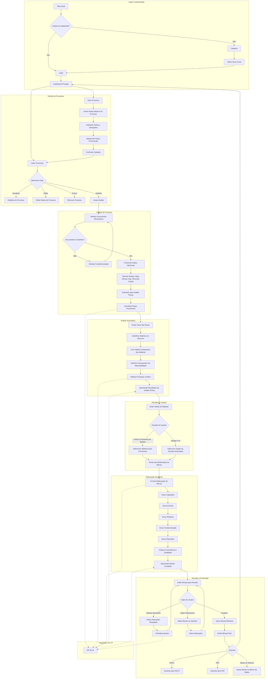

```mermaid
flowchart TB
    subgraph "Login e Autenticação"
        A[Tela Inicial] --> B{Usuário já cadastrado?}
        B -->|Sim| C[Login]
        B -->|Não| D[Cadastro]
        D --> E[Admin Ativa Conta]
        E --> C
        C --> F[Dashboard Principal]
    end
    
    subgraph "Gestão de Processos"
        F --> G[Listar Processos]
        F --> H[Novo Processo]
        H --> I[Inserir Dados Básicos do Processo]
        I --> J[Cadastrar Partes e Advogados]
        J --> K[Upload das Peças Processuais]
        K --> L[Confirmar Cadastro]
        L --> G
        G --> M{Selecionar Ação}
        M -->|Visualizar| N[Detalhes do Processo]
        M -->|Editar| O[Editar Dados do Processo]
        M -->|Excluir| P[Remover Processo]
        M -->|Analisar| Q[Iniciar Análise]
    end
    
    subgraph "Análise do Processo"
        Q --> R[Verificar Documentos Necessários]
        R --> S{Documentos Completos?}
        S -->|Não| T[Solicitar Complementação]
        T --> R
        S -->|Sim| U[Preencher Dados Adicionais]
        U --> V[Informar Relator, Data Ciência, Dep. Recursal, Custas]
        V --> W[Submeter para Análise Prévia]
        W --> X[IA Analisa Peças Processuais]
    end
    
    subgraph "Análise Automática"
        X --> Y[Extrair Texto das Peças]
        Y --> Z[Identificar Matérias do Recurso]
        Z --> AA[Criar Tabela Comparativa das Matérias]
        AA --> AB[Verificar Pressupostos de Admissibilidade]
        AB --> AC[Realizar Pesquisa Jurídica]
        AC --> AD[Apresentar Resultados da Análise Prévia]
    end
    
    subgraph "Decisão do Usuário"
        AD --> AE[Exibir Tabela de Matérias]
        AE --> AF{Decisão do Usuário}
        AF -->|Indicar Provimento por Matéria| AG[Selecionar Matérias para Provimento]
        AF -->|Delegar à IA| AH[Selecionar Opção de Decisão Automática]
        AG --> AI[Enviar para Elaboração da Minuta]
        AH --> AI
    end
    
    subgraph "Elaboração da Minuta"
        AI --> AJ[IA Inicia Elaboração da Minuta]
        AJ --> AK[Gerar Cabeçalho]
        AK --> AL[Gerar Ementa]
        AL --> AM[Gerar Relatório]
        AM --> AN[Gerar Fundamentação]
        AN --> AO[Gerar Dispositivo]
        AO --> AP[Verificar Consistência e Qualidade]
        AP --> AQ[Apresentar Minuta Completa]
    end
    
    subgraph "Revisão e Finalização"
        AQ --> AR[Exibir Minuta para Revisão]
        AR --> AS{Ação do Usuário}
        AS -->|Solicitar Alterações| AT[Indicar Alterações Desejadas]
        AT --> AU[IA Realiza Ajustes]
        AU --> AR
        AS -->|Editar Diretamente| AV[Editar Minuta na Interface]
        AV --> AW[Salvar Alterações]
        AW --> AR
        AS -->|Finalizar| AX[Gerar Minuta Definitiva]
        AX --> AY[Exibir Minuta Final]
        AY --> AZ{Exportar}
        AZ -->|DOCX| BA[Exportar para DOCX]
        AZ -->|PDF| BB[Exportar para PDF]
        AZ -->|Salvar no Sistema| BC[Salvar Minuta no Banco de Dados]
    end
    
    subgraph "Integração com IA"
        X -.-> CA[API de IA]
        AC -.-> CA
        AJ -.-> CA
        AU -.-> CA
        CA -.-> AD
        CA -.-> AQ
    end
    
    AZ --> F
```